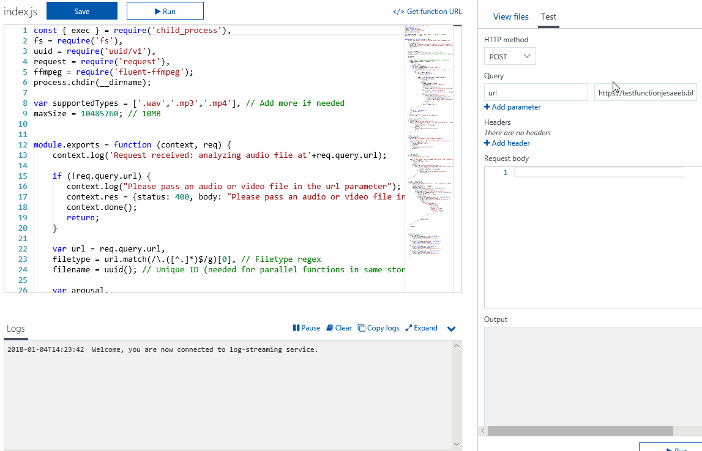

# Azure Function Audio Emotion Recognition
An Azure Function in NodeJS that can analyze emotion (arousal and valence) in audio(voice) fragments. It is based on the work by the Mixed Emotions Project (https://github.com/MixedEmotions/up_emotions_audio), but made easier to scale and implement in real-world scenarios by using Azure Functions.

Note: while this is working as is, it is a proof-of-concept. It is not very well optimized or tested and bugs will be present. Most importantly, it is assumed that the endpoint is only used/reachable by trusted users.

This Azure function performs the following steps:

 1. Trigger via HTTP, take the 'url' query parameter as input (this should be the url to an audio or video file).
 2. Figure out the filetype and abort if it is not one of the whitelisted filetypes (mp3, wav, mp4 currently but more can easily be added).
 3. Download the file (currently max 10MB). 
 4. Convert the file to WAV if it isn't already a WAV file using FFMPEG. 
 5. Extract audio features from WAV to CSV using OpenSmile. 
 6. Pass the CSV data through OpenXBOW to create a bag-of-words representation of the data.
 7. Predict the arousal and valence scores by using the models by the Mixed Emotions project
    (https://github.com/MixedEmotions/up_emotions_audio).

----------

Licenses:

    This project merely brings together different open source components, credits for each of the components goes to their respective authors.
    
    OpenSMILE: distributed free of charge for research and personal use (http://www.audeering.com/research-and-open-source/files/openSMILE-open-source-license.txt) WEKA GPL 3
    
    OpenXBOW: published under GPL v3. Maximilian Schmitt, Björn Schuller: University of Passau.
    
    FFMPEG: FFmpeg codebase is mainly LGPL-licensed with optional components licensed under GPL. Please refer to the LICENSE file for detailed information.